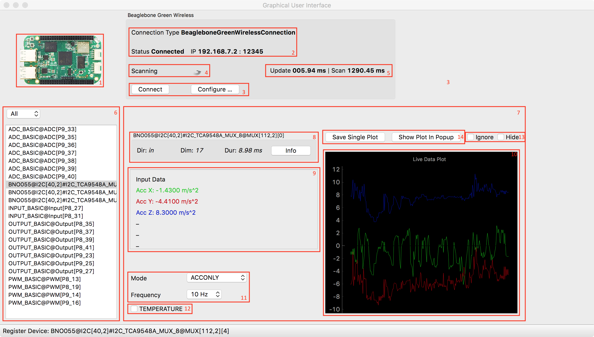

# Interface GUIDE

This guide provides a *user* overview of the Interface and how to use it.

## Intro

The Interface needs to be launched with *python3* from the command line.

Open the terminal

* MACOS: Go to `Applications/Utilities/Terminal.app`
* Windows: Press Windows+X to open the Power Users menu, and then click `Command Prompt` or `Command Prompt (Admin)`.

and type

```
cd /Path/To/Interface
python3 src/main.py
```

which will launch the the Interface and open the main window.


## Main Window

Overview of the Main Window of the Interface.



Menu

| Board               |        
|:--------------------|
| Select Board        |
| Show Hidden Devices |
| Plot Points         |
| Connect             |
| Edit Connection …   |
| Stream              |
| Multi Plot          |
| Stop Scan           |


### Board Selection

In the `Board` menu one can select the option `Select Board` to select the board configuration. One then sees an image of the selected board configuration in `#1` and the connection configuration in `#2`.

The button `Configure…` in `#3` or the option `Edit Connection …` in the `Board` menu opens a dialog to set *IP* and *Port* of the board.

To establish the connection to the board one uses the option `Connect` in the `Board` menu or the button `Connect` in `#3`.

### Board State

Indicator in `#4` is rotating when the board is scanning for new devices. Once the scanning is turned off with the option `Stop Scan` in the `Board` menu, the board keeps its current state and assumes **No Changes** to the electrical setup. This can give a significant performance boost to the data acquisition.

The numbers for *update* and *scan* in `#5` are measurements of the cycle duration on the board.

### Connected Devices

Once the board is connected, the devices connected to the board are listed in `#6`. They have a well-defined format like
```
DRIVER_NAME@CONNECTION[HARDWARE_ADDRESS]{#MUX_DRIVER_NAME[MUX_HARDWARE_ADDRESS][MUX_CHANNEL]}
```
They can be filtered by device connection type with the dropdown menu.

### Selected Devices

#### Device Information

The selected device for the device list is shown in `#7`. In `#8` are the *name*, the *direction* of the data flow, the *dimension* of the data vector and the *duration* of the read cycle for the device. The `Info` button will provide information about the connected device and its driver.

#### Live Data

In `#9`, depending on the *direction*, is the acquired live data (or fields to set data for the device). Additionally in `#10` a live plot of the most recent acquired data is provided. The visible time span used to plot can be changed under the option `Plot Points` in the `Board` menu.

#### Settings And Flags

Settings for the board can be accessed in `#11`, like *device mode*,  *read frequency* or *duty cycle*. Further in `#12` are flags that can be raised and cleared. Those options are only available if the corresponding driver provides them.

The device can be ignored (more info to ignored devices in `Multi Plot`) or hidden from the *Interface* with the options in `#13`. Hidden devices can be displayed with the option `Show Hidden Devices` in the `Board` menu.

#### Single Device Stream

The live data output of a device can be streamed to a separate window with the button `Show Plot In Popup` in `#14` or the values can be streamed to a file formatted with `.csv` by using the button `Save Single Plot` in `#14`. More information about the file format can be found in `API.md`.

### Multi Plot

To display data from multiple devices together, the option `Multi Plot` in the `Board` menu can be used. The data stream from all devices **NOT** ignored or hidden will be plotted in a separate window. Use the ignore option in the device settings to disable certain devices.

### Streaming

To stream data from multiple devices to a file or via UDP, the option `Stream` in the `Board` menu can be used. The data stream from all devices **NOT** ignored or hidden will be plotted in a separate window. Use the ignore option in the device settings to disable certain devices.

* The `Stream > File (.CSV)` streams all the data to a file.
* The `Stream > UDP Protocol` streams all the data with a UDP Socket to the Port `12346`.

(More information to streaming and file formats can be found in `API.md`.)
